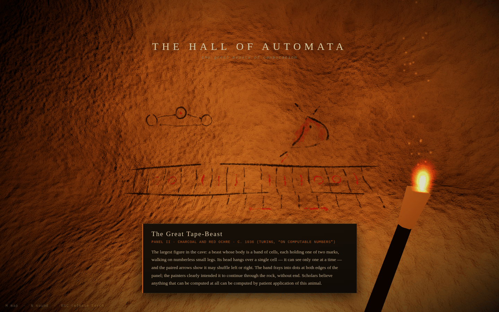
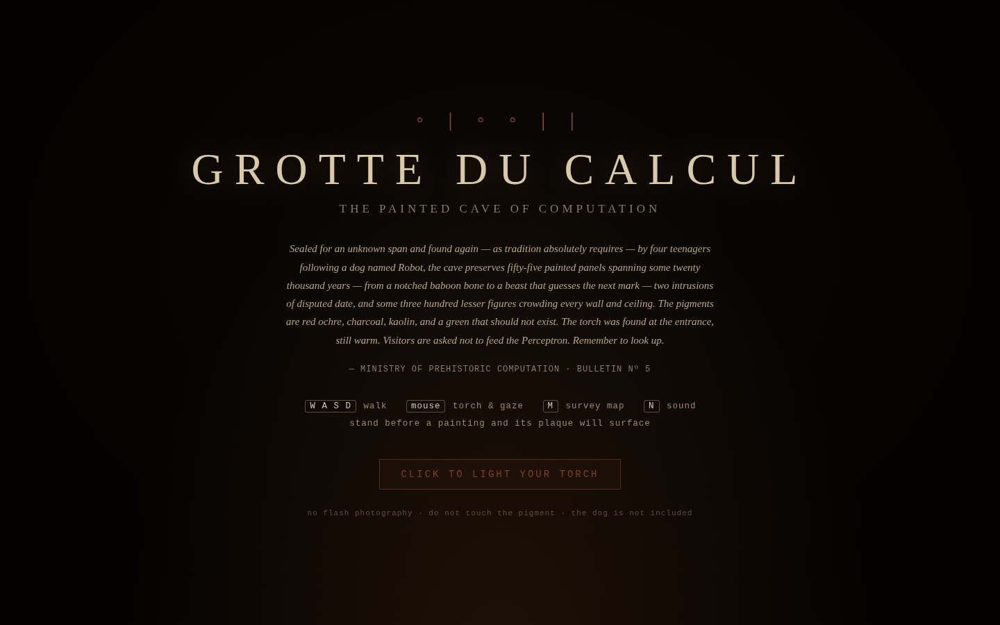

# GROTTE DU CALCUL

*The painted cave of computation. The history of computing, if it happened
17,000+ years earlier.*

**[Enter the cave →](https://recursite.brezgis.com/lascaux/)**



A first-person browser toy: walk into a torchlit cave and read the history of
computation and NLP — from a notched baboon bone of twenty thousand years ago to
the Web, Deep Blue and AlphaGo, plus two intrusions of disputed date — as
parietal art: ochre, charcoal, kaolin, and one pigment that should not exist,
painted flush on the rock. Fifty-five plaqued panels in fifteen chambers. Sealed for an unknown span and found again, as tradition absolutely
requires, by four teenagers following a dog named Robot.¹

¹ The real Lascaux was discovered in 1940 by four teenagers following a dog
actually named Robot. Some things cannot be improved upon.



## The chambers

In roughly the order a visitor meets them (the cave has two loops, so there is
no single right way round):

| Chamber | Panels |
|---|---|
| The Vestibule | hand stencils (and one unidentified appendage), binary counting marks |
| The Chamber of the Ancients (off the entrance passage) | the Ishango tally bone (c. 20,000 BP, engraved), al-Khwārizmī's stepwise hunter (c. 820), Leibniz reading the Book of Changes in binary (1703); overhead, the Antikythera sky-wheel |
| The Engine House | Jacquard's loom that reads cards (1804), Babbage's Difference Engine (1822–1991, half of it dotted), Lovelace's Note G (1843), Boole's corral laws (1854), Hollerith's census herd (1890) |
| The Hall of Automata | the Turing tape-beast, the λ binder, the von Neumann x-ray beast, ENIAC and its six programmers, the first bug (1947, with tape), Colossus the sworn beast (1944, half overpainted in kaolin) |
| The Gallery of Information | Shannon's noisy channel, Markov's chain-serpent (1913), the three-headed n-gram beast; overhead, the Loom of Memory (magnetic-core memory) |
| The Rotunda | Zipf's slope, the Hamming(7,4) ox |
| The Shaft of the Perceptron | the XOR bison goring the fallen Perceptron (after the Shaft scene at Lascaux); on the next wall, The Return (backprop, 1986) |
| The Thaw (below the Shaft) | the Long Winter (the AI winters, and the three who kept the fire), the serpent that remembers (LSTM, 1997), the naming of the ten thousand beasts (ImageNet, AlexNet), king − man + woman (word2vec, 2013) |
| The Nave of Speech | the Chomsky tree and the colorless green sleeper, ELIZA the mirror oracle, the hidden Markov beast, IBM's twin herds of statistical MT |
| The Scriptorium | Grace Hopper the translator (A-0, 1952), the Column and the Nest (FORTRAN and LISP), the hearth of small tools (UNIX, C and the pipe), the flightless bird and the thousand hands (Linux) |
| The Sanctuary of Sand | the gatekeeper on the stone (the transistor, 1947), many beasts in one stone (Kilby and Noyce), the doubling (Moore's law), the whole beast on a fingertip (the 4004) |
| The Gallery of the Hand | the wand of light (Sketchpad), the mouse and the Mother of All Demos, the window wall (the Xerox Alto), the beast comes home (the Altair and the home computer) |
| The Labyrinth (a ring of passages round a pillar) | LO (the first ARPANET message, 1969), the packet herd, the mixing of the paints (public-key cryptography); overhead, the Web; the trackers' rule (PageRank) |
| The Arena | the beast that played itself (Samuel's checkers, 1959), the two paddles (Spacewar! and Pong), the giant and the champion (Deep Blue, 1997), move 37 (AlphaGo, 2016) |
| The Apse (through the crawl) | two recent intrusions, cataloging disputed: attention (2017) and the many-headed guesser (GPT, 2018–2020) |

Stand before a painting and its field-report plaque surfaces. Every plaque is
lore-flavored but historically load-bearing: dates, names, and anecdotes check
out (the moth, the Hansard, the dog).

Beyond the plaqued panels, ~300 lesser figures crowd the walls and ceilings,
Lascaux-dense: marked beasts and little herds, hunters mid-throw, hand
stencils, counting dots, punch-tape ribbons, punched cards with clipped
corners, ferrite core rings, logic-gate trap signs, sorting nets, recursion
spirals, lesser chain-serpents. They are scattered procedurally (seeded, so
every visitor sees the same cave) and have no plaques; they are just the
centuries of other painters.

## Controls

- **WASD / arrows** — walk (Shift to hurry)
- **mouse** — torch & gaze
- **M** — survey map (tracks which panels you have read)
- **N** — sound on/off
- **mouse wheel** — scrolls a long plaque
- **touch** — left half of screen walks, right half looks; MAP and SOUND
  buttons sit top right, and a long plaque scrolls with a finger

## Running

Static files, ES modules — needs any web server (`file://` won't do) and a
browser with WebGL:

```
python3 -m http.server 8000
# then http://localhost:8000
```

Deploy = copy the directory (or push to GitHub Pages). Everything is
self-contained: three.js is vendored in `vendor/`, all art, audio and geometry
are synthesized at load. No build step, no assets, no network calls.
Total payload is ~1.4 MB raw, mostly three.js (~300 KB gzipped on the wire).

## How it works

- **The rock** (`src/cave.js`) — the chamber system is a signed-distance field
  (capsule passages + ellipsoid chambers, smooth-min'd, fbm-roughened, floor-cut
  for walkability), meshed by naive surface nets into one continuous body.
  Each column of the lattice only evaluates the parts near it, so fifteen
  chambers build in a couple of hundred milliseconds.
  Normals come from the field gradient; ambient occlusion is baked by probing
  the field along normals; player collision and painting placement sample the
  same field at runtime. The entrance collapse is carved into the field itself.
- **The paintings** (`src/paint.js`; panels in `src/paintings.js`,
  `src/panels-early.js`, `src/panels-late.js`; shared figures in
  `src/forms.js`) — every panel is stroke-authored and rendered at load
  through a pigment engine: strokes become chains of overlapping finger-daubs
  with wobble, taper, width jitter and dry-brush gaps, then a weathering pass
  erodes the pigment with noise so it sits *in* the rock. Hand stencils are
  spatter-sprayed around Path2D masks; positive prints are daubed inside them;
  engravings are pale scratches with a lip of shadow; finger flutings are
  several strokes drawn at once. Placements live in `PLACEMENTS` in `cave.js`
  (`at(chamber, degrees)` for walls; `CEIL(...)` for ceilings, which also name
  the compass direction their top points).
  Panels are projected onto the rock as decals (`THREE.DecalGeometry`), so they
  hug every bump — the way the Lascaux painters used the wall's bulges.
- **The torch** (`src/torch.js`) — a point light that lives in the flame,
  flickering on smoothed noise (with the odd gust that pulls it low and red),
  falling off a little gentler than inverse-square, and stopping down when
  held close to rock so near walls don't blow out. Teardrop sprite flames
  that lean against your motion, a soft halo, drifting embers.
- **The sound** (`src/audio.js`) — synthesized from nothing: brown-noise wind
  breathing through a lowpass, the torch's low roar and resin snaps, a rare
  water drop (a rising bubble, mostly heard as echo), and footfalls on gritty
  stone tied to your actual stride, wetter in the big chambers. All of it
  shares one convolution reverb whose cave impulse is itself synthesized.

## Dev tools

- `paint-lab.html` — renders all plaqued panels flat on a rock background for
  iterating on the art (`?only=turing,xor&scale=0.8`).
- `motif-lab.html` — the same for the scattered lesser figures
  (`src/motifs.js`), three variants of each.
- `index.html?shot=<panel-id>` or `?shot=x,z,yaw[,pitch]` — positions the
  camera for headless screenshots; `?map=1` opens the survey map.
- To run the walkability simulation or other field tests in Node, give it a
  `three` package pointing at the vendored build:
  ```
  mkdir -p node_modules/three
  printf '{"name":"three","type":"module","exports":"./three.module.js"}' > node_modules/three/package.json
  ln -s ../../vendor/three.module.js node_modules/three/three.module.js
  ```

— Ministry of Prehistoric Computation, Bulletin № 5.
No flash photography. Do not feed the Perceptron.
